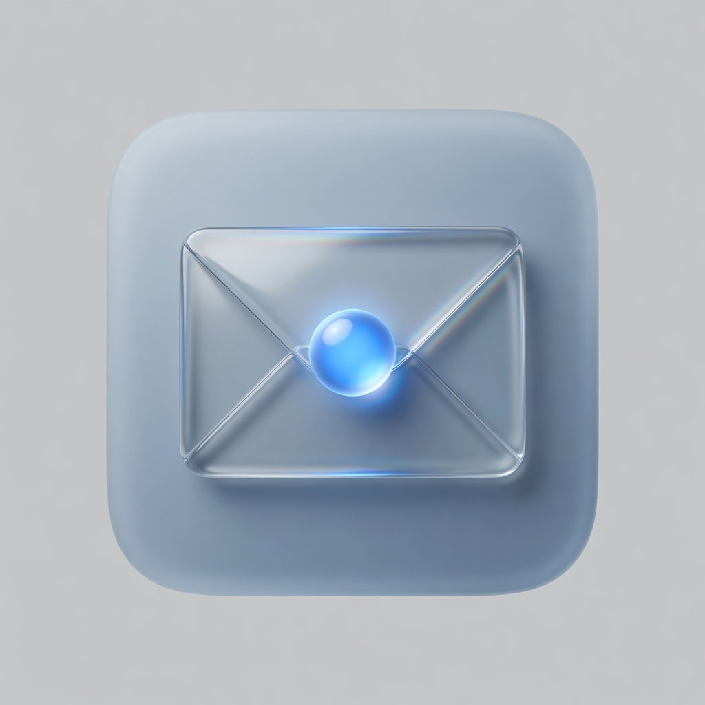

# oh-ai-email

<p align="center">
  
</p>

开源 **AI 邮箱客户端**——连上你现有的邮箱，用更聪明的方式整理收件箱、读信、回信。

🌐 **产品官网与在线演示**：[https://moon-force.github.io/oh-ai-email/](https://moon-force.github.io/oh-ai-email/)

对标 [Spark](https://sparkmailapp.com/) 一类现代邮箱：好上手、重整理与 AI 写作，而不是极客式全快捷键流。

> 只做**客户端**，不托管邮箱、不自建邮件服务器。Gmail / Outlook / 163 / QQ 等支持 IMAP 的邮箱均可接入（具体能力随版本推进）。

---

## 能做什么

### 收件与阅读

- 连接邮箱账号，同步收件箱
- 清晰的列表 + 读信视图，本地缓存，离线也能看已同步的邮件
- 多账号结构预留（持续完善中）
- 读信即联动：**“转为日程”** 一键写入日历、` .ics` 会议附件横幅一键入库、**“+ 加为联系人”** 一键沉淀发件人

### 智能整理（Spark 向）

- **分箱**：把「重要」和「其他」分开，少被订阅和通知淹没
- 归档、删除等基础整理
- 稍后处理、固定、静音等能力按版本逐步加入
- 本地搜索：按发件人、主题、正文快速找到邮件

### AI 助手

- **一键摘要**：长邮件 / 整段对话快速看懂要点
- **草稿回复**：根据来信生成回复，你改完再发（不会擅自发送）
- **改语气 / 扩写 / 缩写**（及翻译等，按版本开放）
- **混合模式**
  - **云端**：默认，效果更好
  - **本机**：可选接入本地模型（如 Ollama），邮件内容尽量不离开你的电脑

### 本地套件：日历与通讯录（零云依赖）

- **日历**：月 / 周 / 日 / 清单四视图；标准 **RFC 5545 ICS** 导入导出；到点原生提醒（可点击回链到日程）；分类/颜色/重复/提醒可配，发件人/地点/参与人可追溯（`sourceMessageId`）
- **通讯录**：姓名/邮箱/多邮箱/电话/公司/职位/标签/星标；**vCard 3.0 VCF** 导入导出；**智能收割**——从已同步邮件发件人一键发现新联系人并入库；写信收件人/抄送自动补全

### 写信与发送

- 新邮件、回复、全部回复
- 草稿保存，避免写到一半丢失
- 收件人/抄送由**通讯录自动补全**（`Autocomplete` + `freeSolo`）

### 体验

- 桌面优先：Windows / macOS / Linux
- 界面采用 **[MUI Material UI](https://mui.com/)**：标准 Material 组件与明暗主题
- 基础快捷键（增强效率，不绑架鼠标操作）

---

## 不做什么

| 不做                | 说明                      |
| ------------------- | ------------------------- |
| 邮件托管 / 域名邮箱 | 你的信仍在原邮箱服务商    |
| 自动乱发邮件        | AI 只给建议，发送由你确认 |
| 一期强推手机 / 鸿蒙 | 移动端与鸿蒙在路线图二期  |

---

## 界面预览

- UI 规范：[`docs/DESIGN.md`](docs/DESIGN.md)（**MUI**）
- 主题实现：[`apps/desktop/src/theme/createAppTheme.ts`](apps/desktop/src/theme/createAppTheme.ts)
- 本地运行：`pnpm -C apps/desktop dev`

（`design/mvp/` 为历史示意稿，**不作为实现准绳**。安装包随版本在 Releases 发布。）

---

## 当前状态

**当前版本：v0.3.0** ✅

- **v0.1.0** 桌面端 MVP：Phase 0 到 Phase 7 全部计划任务；Windows（安装包与便携版）、macOS（.dmg / .zip）、Linux（.AppImage / .deb）跨平台构建；IMAP IDLE 原生零延迟推信、混合双模 AI、智能分箱与稍后处理、语音听写与朗读、系统托盘常驻与自动更新检测。
- **v0.2.0** 智能体架构升级：Pi Agent 核心引擎（流式思考 / 上下文压缩 / 会话持久化）、可视化技能管理器、内置 MCP Mail Server、黑曜石碳暗色系统。
- **v0.3.0** 本地套件：日历（四视图 + ICS 标准 + 30s 调度提醒）与通讯录（标签/星标/VCF + 邮件收割）两大零云依赖套件；读信直通「转为日程 / 加为联系人 / ICS 一键写入」与写信自动补全；详见 [`docs/IMPLEMENTATION.md` 阶段 10](./docs/IMPLEMENTATION.md#阶段-10一期增强--日历通讯录与跨功能联动featcalendar)。

---

## 快速开始与开发 (Development)

```bash
pnpm install

# 1. 启动桌面端开发热重载 (Electron + Vite)
pnpm -C apps/desktop dev

# 2. 启动网页介绍站开发服务
pnpm -C apps/web dev

# 3. 运行全量单元测试 (Vitest)
pnpm test

# 4. 构建验证与代码检查
pnpm lint && pnpm format:check
pnpm -C apps/desktop build:unpack
```

---

## 文档导航

| 文档                                                               | 说明                                      |
| :----------------------------------------------------------------- | :---------------------------------------- |
| [🌐 **官网与在线演示**](https://moon-force.github.io/oh-ai-email/) | 产品官方网站与交互式 AI 功能演示          |
| [📄 **CHANGELOG.md**](CHANGELOG.md)                                | 版本变更记录与发布日志                    |
| [🧭 **docs/PRODUCT.md**](docs/PRODUCT.md)                          | 产品定位、约束与 MVP 边界                 |
| [📋 **docs/IMPLEMENTATION.md**](docs/IMPLEMENTATION.md)            | 分阶段研发清单与验收标准                  |
| [🤖 **docs/AI_TODO.md**](docs/AI_TODO.md)                          | AI 核心决策与各波次（Wave 1-3）特性清单   |
| [⚙️ **docs/AGENT_WORKFLOW.md**](docs/AGENT_WORKFLOW.md)            | 智能体工作流、沙箱工具与 HITL 确认门规范  |
| [🏗️ **docs/ARCHITECTURE.md**](docs/ARCHITECTURE.md)                | 系统分层、数据流、IMAP IDLE 与 IPC 架构   |
| [📦 **docs/DISTRIBUTION.md**](docs/DISTRIBUTION.md)                | 跨平台打包、代码签名与 CI/CD 自动发布指南 |
| [🎨 **docs/DESIGN.md**](docs/DESIGN.md)                            | MUI Material UI 设计规范与主题色彩系统    |
| [📜 **AGENTS.md**](AGENTS.md)                                      | 编码代理规范与仓库开发准则                |

---

## 隐私与安全

- **凭证安全**：邮件账号密码与 API Key 通过操作系统安全存储（Keychain / `safeStorage`）加密存储，绝不经过任何第三方代理服务器；
- **AI 隐私**：支持在「设置中心」自主选择云端模型或本地 **Ollama 离线运行**；
- **发信保护**：内置 AI 辅助检查敏感词与遗忘附件预检，且**绝对不会自动发送邮件**，发送权永远在用户手中。

---

## 许可协议

本项目遵循 [MIT License](LICENSE)。

---

**oh-ai-email** —— 让收件箱更安静，让回复更轻松。
