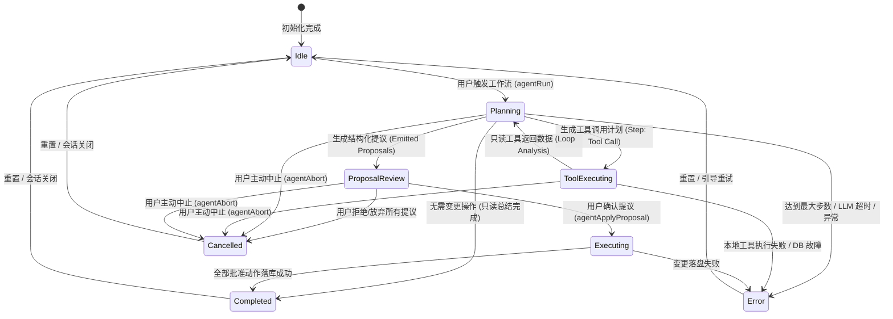
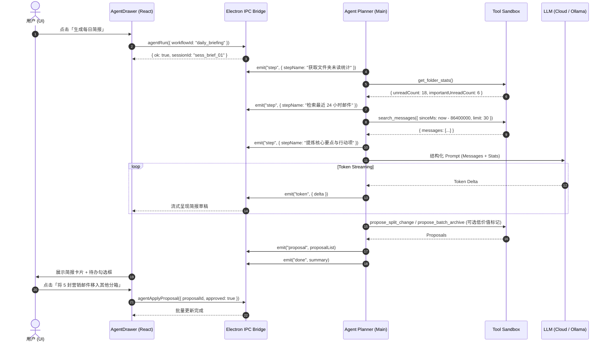
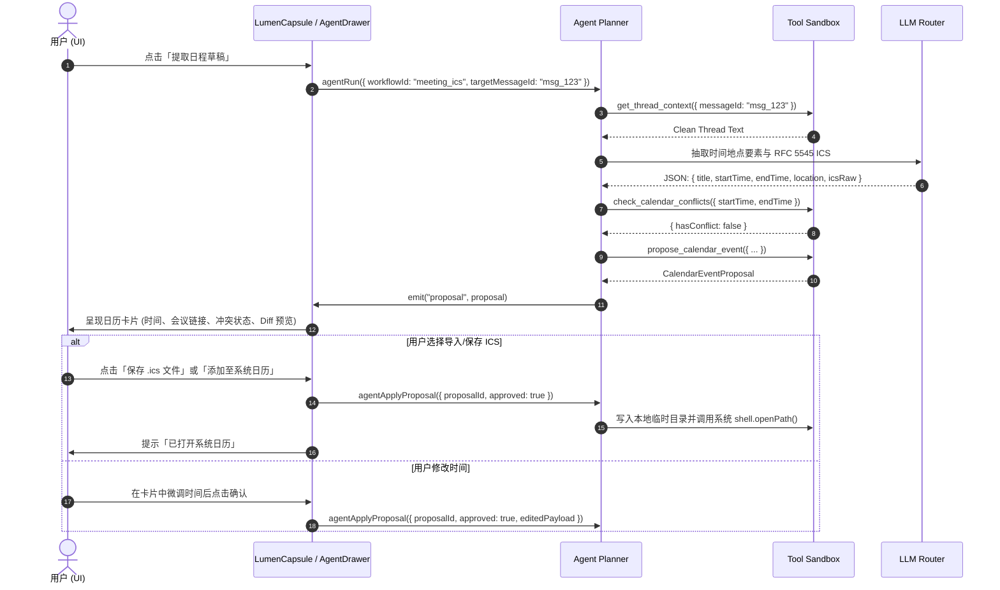
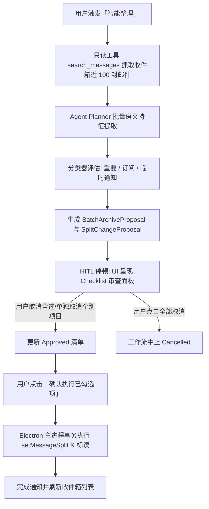

# Agent 流与多步骤智能体工作流架构规范 (Agent Workflow Specification)

> **版本**：v1.0 (2026-03 冻结规范)  
> **定位**：多步骤智能体（Agentic Workflow）编排引擎、工具沙箱与人机协作确认机制  
> **所属分支**：`feat/ai`  
> **相关文档**：[`docs/PRODUCT.md`](./PRODUCT.md) · [`docs/ARCHITECTURE.md`](./ARCHITECTURE.md) · [`docs/AI_TODO.md`](./AI_TODO.md) · [`AGENTS.md`](../AGENTS.md) · [`apps/desktop/src/theme/createAppTheme.ts`](../apps/desktop/src/theme/createAppTheme.ts)

---

## 1. 架构总览与核心设计原则

oh-ai-email 的 Agent 体系定位为**智能工作流副驾**（Co-pilot），而非无监督运行的自动代理。多步骤智能体能够自主规划并调用只读检索工具，但在产生任何破坏性变更或通信外发动作之前，必须经过**人机协同确认网关（Human-in-the-Loop Gate）**。

```
┌────────────────────────────────────────────────────────────────────────────────────────┐
│                                   Agent Core Engine                                    │
│                                                                                        │
│   ┌───────────────┐     ┌────────────────┐     ┌───────────────────────────────────┐   │
│   │ 1. 意图解析   │ ──> │ 2. 计划与执行  │ ──> │ 3. 提议生成 (Proposals)           │   │
│   │ (Goal/Intent) │     │ (Tool Calling) │     │ (Drafts, Split, ICS, Archive List)│   │
│   └───────────────┘     └────────────────┘     └─────────────────┬─────────────────┘   │
└──────────────────────────────────────────────────────────────────┼─────────────────────┘
                                                                   │
                                                      [HITL 安全门拦截]
                                                                   ▼
┌────────────────────────────────────────────────────────────────────────────────────────┐
│                              Human-in-the-Loop (HITL) Gate                             │
│                                                                                        │
│   ┌─────────────────────┐       ┌──────────────────────┐       ┌───────────────────┐   │
│   │ 4. 差异预览 (Diff)  │  ──>  │ 5. 人类勾选/微调     │  ──>  │ 6. 受控批量执行   │   │
│   │ (Visual Checklist)  │       │ (Confirm / Edit)     │       │ (Controlled Write)│   │
│   └─────────────────────┘       └──────────────────────┘       └───────────────────┘   │
└────────────────────────────────────────────────────────────────────────────────────────┘
```

### 1.1 核心设计原则（Core Principles）

1. **确定性安全门（Human-in-the-Loop Gate）**  
   智能体的执行流程严格遵循 `Proposal（提议） -> Diff/Preview（可视化对比） -> Human Confirmation（人类逐项/批量确认） -> Controlled Execution（受控落库执行）`。模型输出的操作指令只能作为草稿提议，无权直接调用具有修改副作用的存储与网络 API。
2. **绝对禁止自动发送邮件（Never Auto-Send Mail）**  
   任何邮件生成动作（回复、新建、跟进）仅可产出草稿或直接填入 Composer 编辑器，最终的「发送」按钮必须由用户在 UI 界面显式点击。
3. **禁止未经确认的批量归档与删除（Never Delete/Archive Without Confirmation）**  
   批量整理任务必须在前端展示清晰的文件清单与分类理由，提供单选/反选复选框，禁止黑盒一键直接静默执行。
4. **双层流式推进协议（Two-Tier Streaming Protocol）**
   - **高层步进流（Step Stream）**：暴露 Agent 的当前阶段（如 `规划检索 -> 获取会话上下文 -> 冲突检测 -> 生成提议`），向用户传递明确的思考进度。
   - **底层 Token 流（Token Stream）**：模型输出分析摘要与草稿正文时以流式实时投递，降低首字延迟与等待焦虑。
5. **本地沙箱与隐私遮罩（Local Sandbox & Privacy Redaction）**
   - 工具全部在 Electron 主进程安全沙箱中受控运行，只读工具严格限制并发与返回数据体积。
   - 发送给云端大模型的上下文自动经过敏感数据遮罩（Redaction：邮箱名、电话、Token 等），且严格遵循用户选定的模式（云端/Ollama 本机），禁止静默跨模式回退。

---

## 2. 智能体执行生命周期状态机

Agent 会话在 Electron 主进程由 `AgentSessionCoordinator` 调度，渲染进程通过响应式状态机驱动 UI 呈现。

### 2.1 状态转移图 (State Diagram)



### 2.2 状态定义与生命周期说明

| 状态             | 描述                             | 准入条件                                         | 允许的用户交互                              |
| ---------------- | -------------------------------- | ------------------------------------------------ | ------------------------------------------- |
| `Idle`           | 空闲状态                         | 系统就绪或上一次会话已归档                       | 触发工作流、修改 AI 配置                    |
| `Planning`       | 意图解析与多步规划中             | 接收到用户指令或上下文输入                       | 中止任务（Abort）                           |
| `ToolExecuting`  | 本地沙箱只读工具执行中           | Planner 产生工具调用指令                         | 中止任务（Abort）                           |
| `ProposalReview` | **核心停顿态**：等待人类审查提议 | 智能体完成所有只读分析并产出 Proposal            | 勾选/取消项目、修改草稿、批准执行、一键丢弃 |
| `Executing`      | 批准动作受控落库与执行           | 用户在 UI 点击「确认应用」                       | 观察进度条                                  |
| `Completed`      | 工作流顺利完成                   | 所有只读分析完成或批准动作均已落地               | 查看总结、查看审计记录、关闭抽屉            |
| `Cancelled`      | 用户中止或放弃                   | 收到 `agentAbort` 信号或丢弃提议                 | 重新触发或关闭                              |
| `Error`          | 执行异常阻断                     | 超时（>60s）、超出步数限制（Max 8 步）、网络失败 | 查看错误原因、一键重试、转设置页            |

---

## 3. 工具沙箱与注册表 (Tools & Sandbox Registry)

所有 Agent 工具在 Electron 主进程注册，按权限严格划分为**只读工具（Read-only Tools）**与**变更提议工具（Mutation Proposals）**。只读工具可直接返回数据给 Agent 闭环推导，写操作工具严禁直接修改 SQLite/IMAP，只能返回标准化的 `ProposalRecord`。

```
┌────────────────────────────────────────────────────────────────────────┐
│                        Main Process Tool Sandbox                       │
│                                                                        │
│   ┌────────────────────────────────────────────────────────────────┐   │
│   │ Read-Only Tools (Auto-executable by Agent in sandbox)          │   │
│   │ ├─ search_messages                                             │   │
│   │ ├─ get_thread_context                                          │   │
│   │ ├─ get_folder_stats                                            │   │
│   │ ├─ extract_action_items                                        │   │
│   │ └─ check_calendar_conflicts                                    │   │
│   └────────────────────────────────────────────────────────────────┘   │
│                                                                        │
│   ┌────────────────────────────────────────────────────────────────┐   │
│   │ Mutation Proposal Tools (Outputs ProposalRecord ONLY)           │   │
│   │ ├─ propose_draft_reply   ──> DraftProposal                      │   │
│   │ ├─ propose_split_change  ──> SplitProposal                      │   │
│   │ ├─ propose_calendar_event──> CalendarIcsProposal                │   │
│   │ └─ propose_batch_archive ──> BatchTriageProposal                │   │
│   └────────────────────────────────────────────────────────────────┘   │
└────────────────────────────────────────────────────────────────────────┘
```

### 3.1 只读工具定义 (Read-only Tools)

#### 1. `search_messages`

- **用途**：全文与元数据检索指定时间跨度、文件夹或分箱的邮件。
- **输入参数**：
  ```typescript
  interface SearchMessagesInput {
    query?: string; // 关键词 (支持 FTS 语法)
    folderId?: string; // 文件夹范围 (如 "INBOX", "SENT")
    split?: "important" | "other"; // 分箱过滤
    sinceMs?: number; // 起始时间戳 (默认最近 24 小时)
    untilMs?: number; // 截止时间戳
    unreadOnly?: boolean; // 仅未读
    limit?: number; // 限制条数 (默认 20，上限 50)
  }
  ```
- **输出格式**：
  ```typescript
  interface SearchMessagesOutput {
    total: number;
    messages: Array<{
      id: string;
      accountId: string;
      folderId: string;
      from: string;
      fromName?: string;
      subject: string;
      snippet: string;
      dateMs: number;
      unread: boolean;
      split: "important" | "other";
    }>;
  }
  ```

#### 2. `get_thread_context`

- **用途**：按时间轴顺序抓取整个会话线程的邮件链，清洗 HTML 标签并保留核心引用关系。
- **输入参数**：
  ```typescript
  interface GetThreadContextInput {
    messageId: string; // 起始邮件 ID
    maxDepth?: number; // 最大线索回溯深度 (默认 10)
    truncateLength?: number; // 单封正文截断长度 (默认 3000 字)
  }
  ```
- **输出格式**：
  ```typescript
  interface GetThreadContextOutput {
    threadId: string;
    subject: string;
    participants: string[];
    messages: Array<{
      id: string;
      sender: string;
      dateLabel: string;
      cleanBody: string;
      attachmentsCount: number;
    }>;
  }
  ```

#### 3. `get_folder_stats`

- **用途**：获取邮箱全局或特定文件夹的统计指标（总数、未读数、重要/其他比例）。
- **输入参数**：
  ```typescript
  interface GetFolderStatsInput {
    accountId?: string;
  }
  ```
- **输出格式**：
  ```typescript
  interface GetFolderStatsOutput {
    totalMessages: number;
    unreadCount: number;
    importantUnreadCount: number;
    otherUnreadCount: number;
    lastSyncedMs: number;
  }
  ```

#### 4. `extract_action_items`

- **用途**：对单封或多封邮件进行语义解析，抽取待办事项、负责人、截止日期与意图。
- **输入参数**：
  ```typescript
  interface ExtractActionItemsInput {
    messageId: string;
    bodyText?: string;
  }
  ```
- **输出格式**：
  ```typescript
  interface ExtractActionItemsOutput {
    tags: string[]; // 如 ["待我回复", "会议邀约", "账单发票"]
    actionItems: string[]; // 具体行动清单
    deadline?: string; // 解析出的时间 (ISO 8601 或友好格式)
    urgency: "high" | "medium" | "low";
  }
  ```

#### 5. `check_calendar_conflicts`

- **用途**：基于本地已记录日程或系统时间区间，排查拟定会议时间是否存在冲突。
- **输入参数**：
  ```typescript
  interface CheckCalendarConflictsInput {
    startTime: string; // ISO 8601 格式
    endTime: string; // ISO 8601 格式
    timezone?: string; // 默认本地时区
  }
  ```
- **输出格式**：
  ```typescript
  interface CheckCalendarConflictsOutput {
    hasConflict: boolean;
    conflictEvents?: Array<{
      title: string;
      startTime: string;
      endTime: string;
    }>;
    suggestedFreeSlots?: Array<{
      startTime: string;
      endTime: string;
    }>;
  }
  ```

---

### 3.2 变更提议工具定义 (Mutation Proposals)

所有变更工具均以 `propose_*` 命名，输出统一标准的 `ProposalRecord` 接口对象，由系统加入待决提议池。

```typescript
export type ProposalType = "draft_reply" | "split_change" | "calendar_ics" | "batch_archive";

export interface BaseProposal<TData> {
  id: string; // 提议全局唯一 ID (如 "prop_abc123")
  sessionId: string; // 所属 Agent 会话 ID
  type: ProposalType; // 提议分类
  title: string; // 提议人类可读摘要 (如 "为「Q3季度规划」生成回复草稿")
  reason: string; // AI 生成理由
  status: "pending" | "approved" | "rejected" | "applied";
  createdAt: number;
  data: TData; // 强类型载荷数据
}
```

#### 1. `propose_draft_reply`

- **用途**：生成拟回复草稿，包括收件人、抄送、主题与富文本/纯文本正文。
- **载荷结构**：
  ```typescript
  export interface DraftReplyPayload {
    targetMessageId: string;
    to: string;
    cc?: string;
    subject: string;
    body: string;
    html?: string;
    tone: "professional" | "friendly" | "concise";
  }
  export type DraftReplyProposal = BaseProposal<DraftReplyPayload>;
  ```

#### 2. `propose_split_change`

- **用途**：提议将特定邮件转移分箱（重要 ↔ 其他）。
- **载荷结构**：
  ```typescript
  export interface SplitChangePayload {
    messageId: string;
    subject: string;
    sender: string;
    currentSplit: "important" | "other";
    targetSplit: "important" | "other";
    confidence: "high" | "medium" | "low";
  }
  export type SplitChangeProposal = BaseProposal<SplitChangePayload>;
  ```

#### 3. `propose_calendar_event`

- **用途**：提取会议邮件关键要素并构造标准 RFC 5545 `.ics` 日历文件草稿。
- **载荷结构**：
  ```typescript
  export interface CalendarEventPayload {
    sourceMessageId: string;
    eventTitle: string;
    startTime: string; // ISO 8601 (如 "2026-03-20T14:00:00+08:00")
    endTime: string; // ISO 8601 (如 "2026-03-20T15:00:00+08:00")
    timezone: string;
    location?: string; // 会议地点或线上会议链接 (腾讯会议/Zoom/Teams)
    organizer: string;
    attendees: string[];
    description: string;
    icsRawContent: string; // 符合 RFC 5545 的 VCALENDAR 文本
  }
  export type CalendarEventProposal = BaseProposal<CalendarEventPayload>;
  ```

#### 4. `propose_batch_archive`

- **用途**：构造批量分拣、标记已读或移入归档/已删除邮件的清单。
- **载荷结构**：
  ```typescript
  export interface BatchArchiveItem {
    messageId: string;
    subject: string;
    sender: string;
    dateLabel: string;
    suggestedAction: "archive" | "trash" | "mark_read";
    riskScore: "low" | "medium" | "high"; // low: 垃圾订阅, high: 含未决行动项
    reason: string;
  }

  export interface BatchArchivePayload {
    items: BatchArchiveItem[];
    summary: string;
  }
  export type BatchArchiveProposal = BaseProposal<BatchArchivePayload>;
  ```

---

## 4. IPC 与双层流式通信协议

Electron 主进程与渲染进程之间的通信包含 **RPC 调用** 与 **双向事件流（IPC Stream）**。

### 4.1 RPC 方法契约 (IPC Methods)

```typescript
// Electron ipcMain 注册与 window.electronApi 绑定
export interface AgentIpcApi {
  /** 启动一个工作流会话，返回会话 sessionId */
  agentRun(params: {
    workflowId: "daily_briefing" | "meeting_ics" | "batch_triage" | "follow_up" | "custom";
    context?: {
      targetMessageId?: string;
      folderId?: string;
      customPrompt?: string;
    };
    mode?: "cloud" | "ollama";
  }): Promise<{ ok: true; sessionId: string } | { ok: false; error: string; code: string }>;

  /** 强制中止正在运行的 Agent 会话 */
  agentAbort(sessionId: string): Promise<{ ok: boolean }>;

  /** 提交人类审批结果并受控执行变更 */
  agentApplyProposal(params: {
    sessionId: string;
    proposalId: string;
    approved: boolean;
    editedPayload?: unknown; // 用户在 UI 上微调后的内容
  }): Promise<{ ok: true; appliedCount: number } | { ok: false; error: string }>;
}
```

### 4.2 实时流事件协议 (`ai:agent:event`)

主进程在执行各阶段通过 `BrowserWindow.webContents.send("ai:agent:event", eventPayload)` 实时广播事件流：

```typescript
export type AgentStreamEvent =
  | {
      type: "step";
      sessionId: string;
      stepId: string;
      stepName: string; // 如 "检索最近 24 小时未读邮件"
      status: "started" | "progress" | "completed" | "failed";
      summary?: string;
      timestamp: number;
    }
  | {
      type: "token";
      sessionId: string;
      stepId: string;
      delta: string; // 实时流式 token 增量
      accumulated: string; // 当前步骤已累积文本
    }
  | {
      type: "proposal";
      sessionId: string;
      proposal: BaseProposal<unknown>; // 产生待人类确认的提案
    }
  | {
      type: "done";
      sessionId: string;
      totalSteps: number;
      summary: string;
      proposalsCount: number;
      durationMs: number;
    }
  | {
      type: "error";
      sessionId: string;
      code: "TIMEOUT" | "NO_KEY" | "LLM_FAIL" | "ABORTED" | "TOOL_ERROR";
      message: string;
      recoverable: boolean;
    };
```

---

## 5. 四大基准工作流规范 (4 Benchmark Workflows)

### 5.1 工作流一：每日晨间简报 (Daily Briefing)

- **业务目标**：用户每天首次打开邮箱时，一键提炼过去 24 小时收到的邮件，智能归类为「待我紧急回复」、「重点项目通报」、「可稍后处理/通知订阅」，并给出清晰行动清单。
- **触发入口**：主界面顶部 Capsule「每日简报」按钮或快捷键。



---

### 5.2 工作流二：会议提取与日历 ICS 生成 (Meeting-to-Calendar)

- **业务目标**：在读信视图下检测到会议通知或邀约时，精准提取会议主题、起止时间戳（含时区换算）、会议软件链接（腾讯会议/Zoom/Teams）及参会人，检测本地日程冲突，并输出符合标准 RFC 5545 的 `.ics` 文件草稿供用户一键导入或保存。
- **触发入口**：读信页面 Lumen Capsule「📅 提取日程」按钮。



---

### 5.3 工作流三：批量分箱与收件箱整理 (Batch Triage & Cleanup)

- **业务目标**：定期清理堆积收件箱。Agent 分析未读/杂乱邮件，识别出通知类、广告订阅类、自动报警类邮件，生成批量标记已读或转移分箱的提议清单。
- **触发入口**：收件箱工具栏「智能整理」按钮。
- **核心保障**：
  1. 默认按照低风险/高风险分级展示；
  2. 每一封邮件都有独立的复选框与判定理由标签（如 `[置信度: 高] 自动化 Jenkins 构建通知`）；
  3. 用户必须显式勾选后点击「执行整理」。



---

### 5.4 工作流四：未回复邮件跟进序列 (Follow-up Sequence)

- **业务目标**：扫描已发送文件夹中超过 $N$ 天（可配置，如 3 天）未收到任何回复的重要发信，分析原文诉求，自动撰写得体、委婉的跟进邮件（Follow-up Draft）。
- **触发入口**：「已发送」视图或 Agent 侧边栏「待跟进列表」。
- **安全保障**：绝不直接外发，点击确认后直接装载至 Composer 编辑器，收件人与主题带 `Re:`，光标位于可编辑正文中。

---

## 6. MUI 前端呈现与交互设计

遵循 [`docs/DESIGN.md`](./DESIGN.md) 与 [`apps/desktop/src/theme/createAppTheme.ts`](../apps/desktop/src/theme/createAppTheme.ts) 的 Material UI 规范，禁止使用外部未经统配的 CSS-in-JS 方案，全面使用 `@mui/material` 构件。

### 6.1 组件结构图

```
┌────────────────────────────────────────────────────────────────────────┐
│ <AgentDrawer> (MUI Drawer / Paper, width: 440px)                       │
│                                                                        │
│  ┌──────────────────────────────────────────────────────────────────┐  │
│  │ <AppBar position="sticky">                                       │  │
│  │   <Toolbar>                                                      │  │
│  │     <AutoAwesomeIcon /> "智能工作流副驾"                          │  │
│  │     <Chip label="Ollama 本地模式" size="small" /> <CloseButton />│  │
│  │   </Toolbar>                                                     │  │
│  │ </AppBar>                                                        │  │
│  └──────────────────────────────────────────────────────────────────┘  │
│                                                                        │
│  ┌──────────────────────────────────────────────────────────────────┐  │
│  │ <AgentStepper activeStep={currentStep}>                          │  │
│  │   <Step><StepLabel>分析邮件链</StepLabel></Step>                 │  │
│  │   <Step><StepLabel>排查日程冲突</StepLabel></Step>               │  │
│  │   <Step><StepLabel>生成提议待审</StepLabel></Step>               │  │
│  │ </AgentStepper>                                                  │  │
│  └──────────────────────────────────────────────────────────────────┘  │
│                                                                        │
│  ┌──────────────────────────────────────────────────────────────────┐  │
│  │ <TokenStreamView>                                                │  │
│  │   实时打字机动画展示 Agent 思考过程与摘要                          │  │
│  └──────────────────────────────────────────────────────────────────┘  │
│                                                                        │
│  ┌──────────────────────────────────────────────────────────────────┐  │
│  │ <ProposalChecklist> (HITL 核心交互区)                            │  │
│  │   ┌───────────────────────────────────────────────────────────┐  │  │
│  │   │ [x] 📅 生成「周五架构评审」日程草稿                       │  │  │
│  │   │     时间: 2026-03-20 14:00 - 15:00 (无冲突)               │  │  │
│  │   │     <Button size="small">预览 ICS</Button>                │  │  │
│  │   └───────────────────────────────────────────────────────────┘  │  │
│  │   ┌───────────────────────────────────────────────────────────┐  │  │
│  │   │ [x] ✉️ 拟定委婉回复草稿                                   │  │  │
│  │   │     "已收到会议邀请，我将准时参加并准备相关材料..."       │  │  │
│  │   │     <Button size="small">插入草稿箱</Button>              │  │  │
│  │   └───────────────────────────────────────────────────────────┘  │  │
│  └──────────────────────────────────────────────────────────────────┘  │
│                                                                        │
│  ┌──────────────────────────────────────────────────────────────────┐  │
│  │ <BottomActionsBox>                                               │  │
│  │   <Button variant="outlined" color="inherit">放弃全部</Button>   │  │
│  │   <Button variant="contained" color="primary">确认执行所选项</Button│
│  └──────────────────────────────────────────────────────────────────┘  │
└────────────────────────────────────────────────────────────────────────┘
```

### 6.2 主题适配规范 (Light / Dark Compatibility)

所有 Agent UI 元素严格遵循 `createAppTheme.ts` 颜色令牌：

| UI 元素                         | 亮色模式 (Light)        | 暗色模式 (Dark)         | 规范约束                          |
| ------------------------------- | ----------------------- | ----------------------- | --------------------------------- |
| 抽屉背景 (`Paper`)              | `#FFFFFF`               | `#141A22`               | 无背景图，平直阴影                |
| 主操作按钮 (`Button:contained`) | `#2F6BFF` (Lumen Blue)  | `#5B8CFF`               | `borderRadius: 999`, 禁用悬浮阴影 |
| 提议卡片背景 (`Paper:outlined`) | `#F8FAFC`               | `#1E2632`               | 细边框 `divider`                  |
| 冲突/高风险提示 (`Alert:error`) | `#E85D4C`               | `#FF7A6A`               | 明确标注危险原因                  |
| 进度光晕/脉冲                   | `rgba(47,107,255,0.08)` | `rgba(91,140,255,0.14)` | 遵循 `prefers-reduced-motion`     |

---

## 7. 异常处理与可观测性审计 (Observability & Audit)

### 7.1 错误码体系

| 错误码               | 触发场景                     | 用户层引导策略                                       |
| -------------------- | ---------------------------- | ---------------------------------------------------- |
| `NO_KEY`             | 云端模式下未配置 API Key     | 弹出对话框直接跳转至设置页配置 Key                   |
| `OLLAMA_OFFLINE`     | 本机模式探测端口 11434 失败  | 提示「未检测到本地 Ollama 运行，请启动后重试」       |
| `TIMEOUT`            | LLM 或工具执行超过 60 秒     | 显示超时卡片，提供「手动重试」与「缩短检索范围」选项 |
| `MAX_STEPS_EXCEEDED` | 单次 Agent 迭代超过 8 步规划 | 自动阻断并输出当前已收集的中间提议                   |
| `CONFLICT_DETECTED`  | 会议时间冲突                 | 日历卡片高亮红色警告，并给出备选空闲时间槽推荐       |

### 7.2 隐私与审计日志记录规范

根据 [`docs/AI_TODO.md`](./AI_TODO.md) 永久红线，系统保留最近 50 条 Agent 调用记录用于本地审计条展示，**绝对禁止记录邮件正文全文与 API 密钥**：

```typescript
export interface AgentAuditRecord {
  sessionId: string;
  workflowId: string;
  timestamp: number;
  mode: "cloud" | "ollama";
  model: string;
  totalTokensApprox: number;
  durationMs: number;
  toolsCalled: string[];
  proposalsCount: number;
  proposalsApprovedCount: number;
  status: "success" | "aborted" | "failed";
}
```

---

---

## 8. 验收与合规清单 (Checklist)

- [x] **红线 1**：执行过程中所有草稿必须由人类在 UI 上最终确认，无任何自动 SMTP 发送逻辑。
- [x] **红线 2**：批量修改分箱与归档具备独立的确认清单，支持全选/单选过滤。
- [x] **红线 3**：双层流式在网络断开或用户点击「取消」时能立即通过 AbortController 销毁主进程进程。
- [x] **组件验收**：`AgentDrawer`、`Stepper`、`ProposalChecklist` 在亮暗模式下对比度均符合 WCAG AA 标准。
- [x] **本地模式**：切至 Ollama 本机模式下，全流程不产生任何对外网络请求。

---

## 9. pi 智能体架构融合规范 (pi Integration Specification)

系统解耦融入了开源智能体项目 [pi](https://github.com/earendil-works/pi) 的核心架构，实现标准化事件流、技能包插件与长上下文生命周期治理：

### 9.1 AgentLoop 事件驱动循环 (`loop.ts`)

- **事件分发**：支持 `thinking_token`、`token`、`tool_start`、`tool_update`、`tool_end`、`compaction`、`proposal`、`done` 等强类型通道。
- **生命周期沙箱钩子**：
  - `beforeToolCall`：前置拦截高危未授权写操作（如禁止直接无确认外发）；
  - `afterToolCall`：后置脱敏与结果修剪，保证传回 LLM 上下文的清洁度。

### 9.2 场景专属技能系统 (Skills Manager)

- **定义格式**：支持 Markdown + YAML Frontmatter（定义 `id`, `name`, `description`, `allowedTools`, `tags`, `systemPrompt`）；
- **内置 4 大核心 Skills**：
  1. 📅 **会议日程提取 (`meeting_extractor`)**
  2. 🧾 **财务发票与报销整理 (`invoice_scanner`)**
  3. 🌐 **跨语种商务邮件外联 (`outreach_translator`)**
  4. 📁 **智能分箱与批量归档 (`smart_sorter`)**
- **动态发现**：支持从本地 `.skills/` 目录加载自定义技能 Markdown 文件。

### 9.3 长上下文自适应压缩 (Compaction)

- **Token 估算器**：采用中英混合字符权重的精准估算算法；
- **自适应摘要**：当多轮会话累积 Token 超过设定阈值（默认 6,000 tokens）时，自动触发分段摘要快照，保留最近 N 轮精细上下文，确保长对话流畅不溢出。

### 9.4 本地会话持久化 (SQLite Persistence)

- 在 SQLite 中建立 `agent_sessions` 与 `agent_messages` 表，完整记录会话元数据、思维链（Thinking Process）、工具调用日志与提议状态，支持多轮历史回放。
