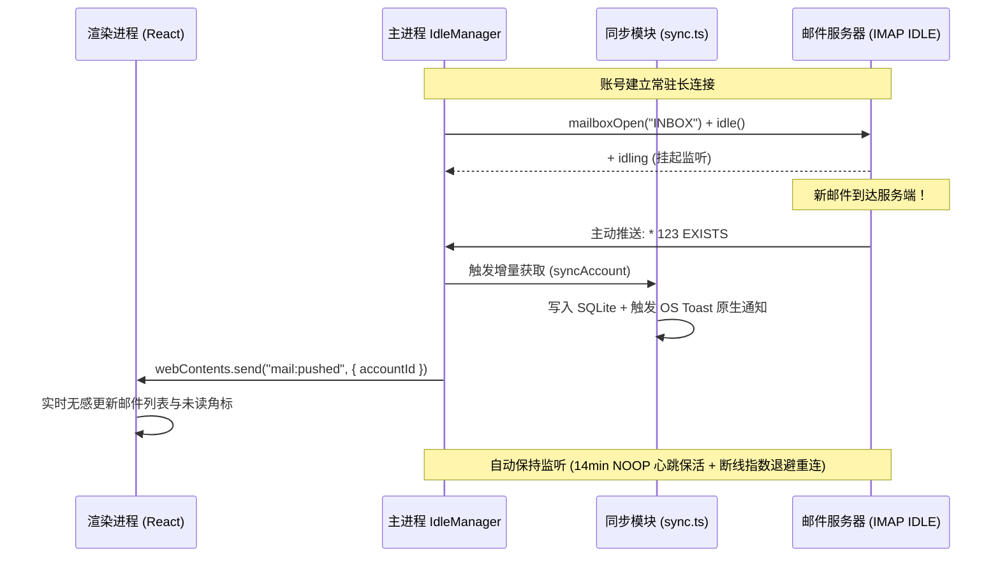

# 架构说明

## 1. 技术栈总览

| 层         | 选型                                          | 职责                                                                                  |
| :--------- | :-------------------------------------------- | :------------------------------------------------------------------------------------ |
| 桌面壳     | **Electron**                                  | 窗口、系统集成、托盘驻留、打包 Win/macOS/Linux                                        |
| UI         | **React + TypeScript + MUI**                  | 列表、读信、写信、设置、AI 胶囊与抽屉；视觉见 [DESIGN.md](./DESIGN.md)（Material UI） |
| 产品官网   | **Vite + 响应式现代 Web (apps/web)**          | 官方介绍页、交互式 AI 模拟器、下载矩阵、GitHub Pages 自动发布                         |
| 主进程核心 | **Node.js / TypeScript (Electron)**           | IMAP/SMTP 协议管理、IMAP IDLE 实时推信、safeStorage 存储、AI 路由与 Agent 引擎        |
| 本地库     | **SQLite**（敏感字段加密 / safeStorage 加密） | 邮件元数据、正文缓存、账号配置、Snooze/Pin/Mute 标记、智能体会话与历史持久化          |
| 日历套件   | **RFC 5545 ICS** + 本地调度器                 | `calendar_events` 全本地日历，四视图 + ICS 导入导出 + 到期前提醒（30s 轮询 + 原生通知） |
| 通讯录套件 | **vCard 3.0 VCF** + 智能收割                  | `contacts` 本地通讯录，标签/星标/多邮箱 + VCF 导入导出 + 邮件发件人一键收割            |
| 云端 AI    | 多厂商预设与 OpenAI 兼容代理通道              | DeepSeek (`deepseek-chat`, `deepseek-reasoner`), 小米 MiMo, 自定义兼容端点            |
| 本地 AI    | **Ollama** HTTP API                           | 用户可选（`127.0.0.1:11434`），邮件内容不经云                                         |
| 语音交互   | **Web Speech API + MiMo WAV 直采**            | 语音听写 (STT: WebSpeech / MiMo ASR WAV) + 邮件/摘要朗读 (TTS: MiMo TTS / SpeechSynthesis) |

## 2. 逻辑分层

```
┌──────────────────────────────────────────────────────┐
│  Presentation（React + TypeScript + MUI）           │
│  收件箱 / 读信 / 写信 / 分箱 / 日历 / 通讯录 / AI      │
├──────────────────────────────────────────────────────┤
│  Electron IPC（invoke/handle + events 双向通道）       │
├──────────────────────────────────────────────────────┤
│  Main Application（Node.js / Electron 主进程）         │
│  同步编排 · 发送流水线 · AI 路由 · Agent 引擎与沙箱    │
│  日历调度器 (CalendarScheduler 30s 轮询) · 通讯录收割   │
├──────────────────────────────────────────────────────┤
│  Domain & Storage                                    │
│  Account · Message · Thread · Draft · CalendarEvent  │
│  Contact · SQLite 缓存 (messages/folders/calendar_   │
│  events/contacts/agent_sessions/custom_skills/...)   │
├──────────────────────────────────────────────────────┤
│  Infrastructure                                      │
│  IMAP/SMTP · safeStorage · CloudAI · Ollama · FS     │
│  RFC 5545 ICS · vCard 3.0 VCF · OS Notification       │
└──────────────────────────────────────────────────────┘
```

## 3. Monorepo 仓库结构

```
oh-ai-email/
├── .github/
│   └── workflows/               # CI 代码检查、Release 跨平台打包与 Pages 自动部署
├── apps/
│   ├── desktop/                 # Electron 桌面应用主体
│   │   ├── src/                 # React 渲染进程（MUI 界面与业务域模块）
│   │   │   └── features/        # 按业务域自包含模块 (ai, calendar, contacts, composer, mail, settings, voice...)
│   │   └── electron/            # Electron 主进程 (IPC, AI 引擎, calendar/contacts 套件, 密钥存储, IMAP IDLE, 托盘)
│   └── web/                     # 官方产品介绍网站 (GitHub Pages 部署)
├── docs/                        # 架构、设计、工作流、分发与实施规范文档
├── package.json / pnpm-workspace.yaml
└── README.md
```

## 4. 邮件数据流

### 4.1 同步（收 — 增量轮询与保底）

```
用户账号配置
    → IMAP CONNECT + AUTH
    → 选文件夹（INBOX…）
    → 增量 UID / MODSEQ（能则 CONDSTORE）
    → 拉 HEADER + 需要时 BODY
    → 解析 MIME
    → 写入 SQLite
    → 推送 UI 事件（folder_updated / message_upserted）
```

### 4.2 主动推送（IMAP IDLE Push Mail — RFC 2177 毫秒级推信）

客户端通过主进程 `IdleManager` (`apps/desktop/electron/mail/idle.ts`) 为每个活跃账号维持轻量级长连接，实现真正的服务端主动推信：



### 4.3 发送（发）

```
UI 草稿
    → 校验收件人/主题/正文
    → SMTP 发送
    → 可选 APPEND 到 Sent
    → 更新本地状态
```

### 4.4 读信

```
UI 点开 message_id
    → 本地有 BODY 则直接展示
    → 否则 IMAP FETCH → 缓存 → 展示
```

## 5. AI 与多步骤智能体数据流 (AI & Agentic Workflow)

> 详细 Agent 架构规范、工具沙箱与状态机设计参见 [`docs/AGENT_WORKFLOW.md`](./AGENT_WORKFLOW.md) 及 [`docs/AI_TODO.md`](./AI_TODO.md)。

### 5.1 单步快捷 AI 任务（Wave-1 / Wave-2）

```
UI 触发（Capsule 摘要 / 润色 / 快速回复 / 意图识别）
    → Electron 主进程 AI 路由
        → 组装上下文（去引用噪音、截断、敏感信息 Redaction 策略）
        → mode == cloud ? CloudAI : Ollama (localhost:11434)
        → 返回结构化/文本结果
    → UI 渲染可编辑草稿，人类确认后插入/发送
```

### 5.2 多步骤智能体工作流流水线（Wave-3 Agentic Workflow - 融合 pi 架构）

对于多轮规划、批量分箱整理、会议日程提取及财务发票整理等复合任务，系统采用**受控智能体管道（Controlled Agentic Pipeline）**：

```
┌────────────────────────────────────────────────────────────────────────────────────────┐
│                              1. 渲染进程 (UI: React + MUI)                             │
│  用户触发指令 / 快捷技能 (Skills: 会议/发票/外联/分箱)                                 │
│       │                                                                                │
│  agentRun({ agentType, skillId, context }) ──┐                                         │
│       ▲                                      │                                         │
│       │ 监听流式事件 (ai:agent:stream)       │                                         │
│       ├─ Thinking Stream: 实时折叠推理流 (DeepSeek R1 / CoT)                           │
│       ├─ Step & Token Stream: 实时打字机与工具进度                                     │
│       ├─ Compaction Notification: 自动长上下文压缩提示                                 │
│       └─ Proposal Stream: 结构化提议清单 (日历/草稿/分箱/发票)                          │
│       │                                                                                │
│  [HITL 审查区] 用户勾选/编辑提议 ──> acceptSelected() / acceptAll()                    │
└───────┼──────────────────────────────────────┬─────────────────────────────────────────┘
        │                                      │
        ▼ (IPC Bridge)                         ▼ (IPC Bridge)
┌────────────────────────────────────────────────────────────────────────────────────────┐
│                        2. Electron 主进程 Agent 协调器 (Inspired by pi)                 │
│                                                                                        │
│   ┌────────────────────────────────────────────────────────────────────────────────┐   │
│   │ AgentLoop 事件流循环引擎 (electron/ai/agent/loop.ts)                            │   │
│   │  ├─ 细粒度事件流: step -> thinking_token -> token -> tool_start/end -> proposal│   │
│   │  ├─ 生命周期拦截沙箱: beforeToolCall (安全策略/HITL阻断) & afterToolCall (脱敏) │   │
│   │  ├─ 场景专属技能管理: SkillsManager (内置4大技能 + 支持 .skills/ 动态加载)     │   │
│   │  ├─ 上下文自适应压缩: Compaction (Token预算估算 + 历史分段摘要快照)            │   │
│   │  └─ 负责超时控制 (60s)、最大轮次截断与 AbortController 实时中断取消           │   │
│   └──────────────────────────────────────┬─────────────────────────────────────────┘   │
│                                          │                                             │
│                     ┌────────────────────┴────────────────────┐                        │
│                     ▼                                         ▼                        │
│   ┌───────────────────────────────────┐     ┌──────────────────────────────────────┐   │
│   │ Read-Only Tools (只读执行沙箱)    │     │ Mutation Proposals (变更提议生成器)  │   │
│   │ ├─ search_messages (FTS 检索)     │     │ ├─ propose_draft_reply (草稿提案)    │   │
│   │ ├─ extract_meeting_details (会议) │     │ ├─ propose_calendar_event (RFC 5545) │   │
│   │ ├─ extract_invoice_entries (发票) │     │ ├─ propose_invoice_entry (报销提案)  │   │
│   │ ├─ extract_commitments (待办提取) │     │ ├─ propose_split_change (分箱调整)   │   │
│   │ └─ extract_triage_suggestions     │     │ └─ propose_batch_archive (整理清单)  │   │
│   │    (重要度与紧急度评估)           │     │ [严禁直接落库，必须生成 ProposalRecord]│   │
│   └───────────────────────────────────┘     └──────────────────────────────────────┘   │
│                                                                                        │
│   ┌────────────────────────────────────────────────────────────────────────────────┐   │
│   │ SQLite 本地多轮会话持久化 (agent_sessions & agent_messages)                      │   │
│   │ 完整持久化会话上下文、思维链 (Thinking Stream)、工具调用与 HITL 待执行提议     │   │
│   ├────────────────────────────────────────────────────────────────────────────────┤   │
│   │ 3. 受控执行引擎 (Controlled Execution Engine)                                   │   │
│   │ 仅在收到用户批准 (acceptSelected / acceptAll) 后，以原子事务更新 SQLite / 草稿箱 │   │
│   └────────────────────────────────────────────────────────────────────────────────┘   │
└────────────────────────────────────────────────────────────────────────────────────────┘
```

### 5.3 多 Provider 预设、动态模型发现与余额查询架构

系统支持灵活的云端与本机模型路由体系，内置主流厂商快速预设并兼容任意 OpenAI 格式服务端点：

```
┌────────────────────────────────────────────────────────────────────────────────────────┐
│                        AI Router & Multi-Provider Architecture                         │
│                                                                                        │
│   ┌────────────────────────────────────────────────────────────────────────────────┐   │
│   │ 预设 Provider 矩阵 (Settings UI & Storage)                                     │   │
│   │ ├─ DeepSeek: https://api.deepseek.com (deepseek-chat, deepseek-reasoner)       │   │
│   │ ├─ 小米 MiMo: https://api.xiaomimimo.com/v1 (mimo-v2.5, mimo-v2.5-pro, TTS)     │   │
│   │ ├─ 本地 Ollama: http://127.0.0.1:11434 (llama3.2, qwen2.5, deepseek-r1 等)     │   │
│   │ └─ Custom: 自定义 BaseURL + 自备 API Key                                       │   │
│   └──────────────────────────────────────┬─────────────────────────────────────────┘   │
│                                          │                                             │
│                     ┌────────────────────┴────────────────────┐                        │
│                     ▼                                         ▼                        │
│   ┌───────────────────────────────────┐     ┌──────────────────────────────────────┐   │
│   │ 动态模型拉取 (Model Discovery)    │     │ 账户余额与额度查询 (Balance Query)   │   │
│   │ ├─ 云端通道: GET ${baseUrl}/models│     │ ├─ DeepSeek: GET /user/balance       │   │
│   │ └─ Ollama 通道: GET /api/tags     │     │ └─ 渲染剩余配额与赠送余额状态        │   │
│   └───────────────────────────────────┘     └──────────────────────────────────────┘   │
└────────────────────────────────────────────────────────────────────────────────────────┘
```

### 5.4 深度思考流与 Reasoning Token 处理 (DeepSeek R1)

针对带思考链（Chain-of-Thought）的推理模型（如 `deepseek-reasoner` / Ollama `deepseek-r1`）：

- **流式解析**：主进程监听 SSE 数据流，提取 `choices[0].delta.reasoning_content`（思考 Token）与 `choices[0].delta.content`（正文 Token）。
- **双通道广播**：通过 IPC 事件分别向前端投递 `reasoning` 与 `content` 增量。
- **UI 独立呈现**：前端 `LumenCapsule` 与 `AgentDrawer` 中以可折叠面板单独展示「思考过程」，与最终生成文本/草稿保持物理分离，确保草稿插入 Composer 时仅写入清洁正文。

### 5.5 语音交互流水线 (Voice Integration: STT & TTS)

> Web Speech 为兜底；当用户在设置中将 STT/TTS 设为 `custom` 且授权麦克风后，优先走云端通道（MiMo/OpenAI 兼容）。STT 采用 **MediaRecorder / WebAudio WAV 直采** 双路径，TTS 采用 **云端音频流播放**。

```
┌────────────────────────────────────────────────────────────────────────────────────────┐
│                              Voice Capabilities Architecture                           │
│                                                                                        │
│   【语音口述听写 (STT)】  voiceService.ts / startSpeechRecognition()                   │
│       前置判断: sttService == "custom" && has mic permission ? 云端 : Web Speech      │
│       ┌─ 云端通道 (MediaRecorder / MiMo WAV 直采)                                      │
│       │   麦克风 MediaStream ──> MediaRecorder(webm/opus) / ScriptProcessor(WAV PCM16)│
│       │       └─> 转 base64 ──> ai:transcribeAudio (MiMo/OpenAI 兼容 STT) ──> 最终文本│
│       └─ 兜底: 浏览器 Web Speech API (webkitSpeechRecognition, zh-CN, interim+final)  │
│                                   │                                                    │
│                                   ▼ 追加至 Composer 提示框 / 编辑器光标处             │
│                                                                                        │
│   【邮件与摘要朗读 (TTS)】  voiceService.ts / speakText()                             │
│       前置判断: ttsService == "custom" ? 云端 : 本地                                   │
│       ├─ 云端: ai:synthesizeSpeech (MiMo TTS / OpenAI TTS, 返回 data:audio/* ) -> Audio│
│       └─ 兜底: 原生 window.speechSynthesis (SpeechSynthesisUtterance)                 │
│                                   │                                                    │
│                                   ▼ 播放控制器 (Play / Pause / 进度 / 0.8x-1.5x 语速)  │
└────────────────────────────────────────────────────────────────────────────────────────┘
```

### 5.6 核心原则与安全红线

- **Human-in-the-Loop 安全门**：所有 Agent 产生的外发、修改与分箱动作均为「提议」，禁止直接无监督执行。
- **绝不自动发送邮件**：回复草稿必须插入 Composer，由用户手动点击发送。
- **禁止静默跨模式回退**：云端失败不可私自降级打本地，本地失败不可私自上云，严格保护用户隐私预期。
- **最小化审计日志**：记录调用步数、耗时与 Token 统计，严禁落盘邮件正文与 API 密钥。

## 6. 本地套件架构：日历与通讯录 (Calendar & Contacts)

> 两套件均为 **本地优先、无云依赖** 的 SQLite 模块，通过 IPC 暴露给渲染进程；与邮件的联动均为显式用户动作，不做后台自动扫描。

### 6.1 日历 (Calendar) — `electron/calendar/*` + `src/features/calendar/*`

- **数据模型**：`calendar_events` 表（`id/title/description/location/start_time/end_time/allDay/category/color/status/attendees/sourceMessageId/icsUid/recurrence/remindMinutesBefore/isReminded`），索引 `start_ms` / `remind` / `source_message_id`。
- **RFC 5545 ICS 标准**：`service.ts` 提供 `exportEventsToIcs` / `parseIcsContent` / `importIcsEvents`；顶层 `BEGIN:VCALENDAR` + `VEVENT`（`UID/DTSTAMP/DTSTART/DTEND/SUMMARY/DESCRIPTION/LOCATION/CATEGORIES/STATUS/ATTENDEE`），支持折叠行展开、缺 `DTEND` 默认 +1h。
- **UI 四视图**：`MonthView` / `WeekView` / `DayView` / `AgendaView`（`CalendarView.tsx` 工具栏统一切换 `month|week|day|agenda`），`EventDialog` 承载新建/编辑/查看三态，`IcsImportDialog` 承接文件导入。
- **状态管理**：`calendarStore.ts`（Zustand）管理 `events/selectedDate/viewMode/eventDialog/*` + `loadEvents/saveEvent/removeEvent/importIcs/exportIcs/todayEvents/eventsForDate`。
- **提醒调度器**：`scheduler.ts` 在 `main.ts` 启动（`startCalendarScheduler` / `stopCalendarScheduler`），30s 轮询 `getUpcomingReminders(now, 60s)`，到期触发 `Notification`（点击唤起窗口并 `calendar:open-event` 深链到对应日程）。
- **IPC**：`calendar:list/get/create/update/delete/importIcs/exportIcs/exportIcsDialog` + 事件 `calendar:open-event`。

### 6.2 通讯录 (Contacts) — `electron/contacts/*` + `src/features/contacts/*`

- **数据模型**：`contacts` 表（`id/name/email/secondaryEmails/phone/company/jobTitle/avatarColor/notes/tags/isStarred/lastContactedAt`），索引 `email/name/starred`。
- **vCard 3.0 标准**：`service.ts` 提供 `exportContactsToVcf` / `parseVcfContent` / `importVcfContacts`（`FN/N/EMAIL/TEL/ORG/TITLE/NOTE/CATEGORIES`），导入时按 `email` 去重合并标签。
- **智能收割 (Harvest)**：`harvestContactsFromMessages(limit)` 聚合 `messages.from_addr` 去重、排除已入库邮箱，按 `lastDateMs` 排序返回候选，供 `ContactHarvesterDialog` 一键入库。
- **UI**：`ContactsView.tsx` 三栏布局（分类/标签侧栏 + 搜索列表 + 详情），`ContactDialog` / `VcfImportDialog` / `ContactHarvesterDialog` 三弹窗，`contactsStore.ts` 管理 `contacts/searchQuery/selectedTag/starredOnly/dialogs/harvester`。
- **IPC**：`contacts:list/get/create/update/delete/toggleStar/harvest/importVcf/exportVcf/exportVcfDialog`。

### 6.3 跨功能联动 (Cross-Feature Workflows)

| 入口 | 触发 | 目标 | 实现 |
| ---- | ---- | ---- | ---- |
| 读信 `Reader` · **转为日程** | 任意邮件顶栏按钮 | 日历新建 | `useCalendarStore.openCreateDialog({ title/description/sourceMessageId/startTime/endTime })` |
| 读信 `Reader` · **.ics 附件横幅** | 检测 `*.ics` 或 `contentType: calendar` 附件 | 日历一键写入 | 同上，横幅 `Paper` + `一键写入日历` 按钮 |
| 读信 `Reader` · **+ 加为联系人** | 发件人不在库时展示 | 通讯录新建 | `useContactsStore.openCreateDialog({ name/email })` |
| 写信 `Composer` · **收件人/抄送自动补全** | 输入 `To/Cc` | 通讯录建议 | `Autocomplete` 以 `contacts` 为 `options`，`freeSolo` 允许手输 |
| 侧栏 `Sidebar` | Badge 实时计数 | 日历/通讯录入口 | `todayEvents().length`（今日日程）/ `contacts.length` |

## 7. 关键文件索引 (Key File Map)

| 域 | 主进程 | 渲染进程 | 共享/IPC |
| -- | ------ | -------- | -------- |
| 邮件同步 | `electron/mail/sync.ts` · `idle.ts` | `features/mail/*` | `electron/preload.ts` · `src/lib/ipc.ts` |
| 日历 | `electron/calendar/service.ts` · `scheduler.ts` | `features/calendar/*` (4 视图 + Store) | 同上 (`calendar:*` 通道) |
| 通讯录 | `electron/contacts/service.ts` | `features/contacts/*` (三栏 + Store) | 同上 (`contacts:*` 通道) |
| AI/Provider | `electron/ai/providers/openai.ts` · `complete.ts` | `features/ai/*` · `voice/*` | `ai:*` / `ai:synthesizeSpeech` / `ai:transcribeAudio` |
| 存储 | `electron/db.ts` (SQLite `sql.js`) · `store.ts` (`safeStorage`) | — | — |
| 壳层 | `electron/main.ts` · `tray.ts` · `notifications.ts` | `src/App.tsx` · `features/shell/Sidebar.tsx` | — |

## 8. 安全与隐私

## 9. 协议策略

| 协议              | 一期       | 说明                        |
| ----------------- | ---------- | --------------------------- |
| IMAP              | 必须       | 最大兼容                    |
| SMTP              | 必须       | 发送                        |
| OAuth（Gmail/MS） | 一期可后置 | 手动应用密码/专用密码先跑通 |
| JMAP              | 二期+      | 现代同步，可作为增强路径    |
| ICS (RFC 5545)    | 已内置     | 日历导入导出与日程交换      |
| vCard 3.0 (VCF)   | 已内置     | 通讯录导入导出与名片交换    |

## 10. 二期多端预留

- 业务能力尽量沉在 `mail-core` / `mail-store` / 同步协议语义
- UI 可换 Flutter / RN / uni-app，不直接依赖 React 组件
- 云端仅做：AI 代理、可选设置同步、推送（若需要），**邮件正文权威源仍是用户邮服 + 本地缓存**

## 11. 非功能指标（一期目标）

| 项       | 目标                               |
| -------- | ---------------------------------- |
| 安装包   | 显著小于典型 Electron 邮箱客户端   |
| 空闲内存 | 尽量低于同功能 Electron 方案       |
| 首次同步 | 可后台进行，UI 先展示已有/增量结果 |
| 崩溃面   | 同步错误不拖垮 UI 进程             |
