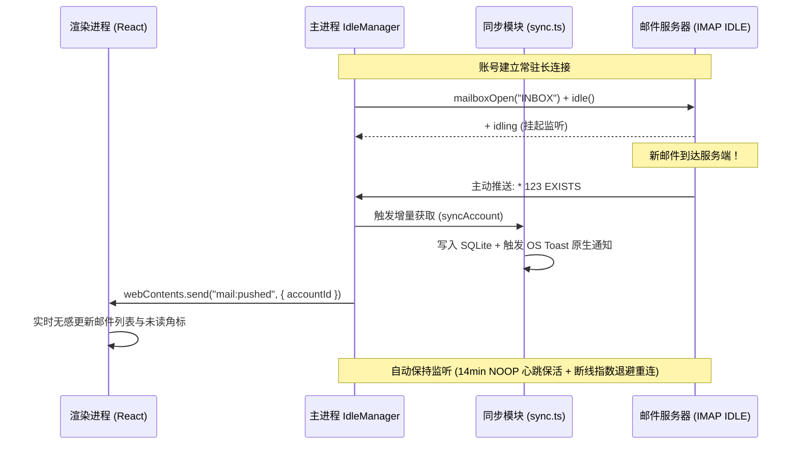

# 架构说明

## 1. 技术栈总览

| 层         | 选型                                          | 职责                                                                                  |
| :--------- | :-------------------------------------------- | :------------------------------------------------------------------------------------ |
| 桌面壳     | **Electron**                                  | 窗口、系统集成、托盘驻留、打包 Win/macOS/Linux                                        |
| UI         | **React + TypeScript + MUI**                  | 列表、读信、写信、设置、AI 胶囊与抽屉；视觉见 [DESIGN.md](./DESIGN.md)（Material UI） |
| 产品官网   | **Vite + 响应式现代 Web (apps/web)**          | 官方介绍页、交互式 AI 模拟器、下载矩阵、GitHub Pages 自动发布                         |
| 主进程核心 | **Node.js / TypeScript (Electron)**           | IMAP/SMTP 协议管理、IMAP IDLE 实时推信、safeStorage 存储、AI 路由与 Agent 引擎        |
| 本地库     | **SQLite**（敏感字段加密 / safeStorage 加密） | 邮件元数据、正文缓存、账号配置、Snooze/Pin/Mute 标记                                  |
| 云端 AI    | 多厂商预设与 OpenAI 兼容代理通道              | DeepSeek (`deepseek-chat`, `deepseek-reasoner`), 小米 MiMo, 自定义兼容端点            |
| 本地 AI    | **Ollama** HTTP API                           | 用户可选（`127.0.0.1:11434`），邮件内容不经云                                         |
| 语音交互   | **Web Speech API + MiMo TTS**                 | 语音听写 (STT) + 邮件/摘要朗读 (TTS)                                                  |

## 2. 逻辑分层

```
┌──────────────────────────────────────────────────────┐
│  Presentation（React + TypeScript + MUI）           │
│  收件箱 / 读信 / 写信 / 分箱 / 设置 / AI 胶囊与抽屉     │
├──────────────────────────────────────────────────────┤
│  Electron IPC（invoke/handle + events 双向通道）       │
├──────────────────────────────────────────────────────┤
│  Main Application（Node.js / Electron 主进程）         │
│  同步编排 · 发送流水线 · AI 路由 · Agent 引擎与沙箱    │
├──────────────────────────────────────────────────────┤
│  Domain & Storage                                    │
│  Account · Message · Thread · Draft · SQLite 缓存   │
├──────────────────────────────────────────────────────┤
│  Infrastructure                                      │
│  IMAP/SMTP · safeStorage · CloudAI · Ollama · FS     │
└──────────────────────────────────────────────────────┘
```

## 3. Monorepo 仓库结构

```
oh-ai-email/
├── .github/
│   └── workflows/               # CI 代码检查、Release 跨平台打包与 Pages 自动部署
├── apps/
│   ├── desktop/                 # Electron 桌面应用主体
│   │   ├── src/                 # React 渲染进程（MUI 界面与业务域模块）
│   │   │   └── features/        # 按业务域自包含模块 (ai, composer, mail, settings, voice...)
│   │   └── electron/            # Electron 主进程 (IPC, AI 引擎, 密钥存储, IMAP IDLE, 托盘)
│   └── web/                     # 官方产品介绍网站 (GitHub Pages 部署)
├── docs/                        # 架构、设计、工作流、分发与实施规范文档
├── package.json / pnpm-workspace.yaml
└── README.md
```

## 4. 邮件数据流

### 4.1 同步（收 — 增量轮询与保底）

```
用户账号配置
    → IMAP CONNECT + AUTH
    → 选文件夹（INBOX…）
    → 增量 UID / MODSEQ（能则 CONDSTORE）
    → 拉 HEADER + 需要时 BODY
    → 解析 MIME
    → 写入 SQLite
    → 推送 UI 事件（folder_updated / message_upserted）
```

### 4.2 主动推送（IMAP IDLE Push Mail — RFC 2177 毫秒级推信）

客户端通过主进程 `IdleManager` (`apps/desktop/electron/mail/idle.ts`) 为每个活跃账号维持轻量级长连接，实现真正的服务端主动推信：



### 4.3 发送（发）

```
UI 草稿
    → 校验收件人/主题/正文
    → SMTP 发送
    → 可选 APPEND 到 Sent
    → 更新本地状态
```

### 4.4 读信

```
UI 点开 message_id
    → 本地有 BODY 则直接展示
    → 否则 IMAP FETCH → 缓存 → 展示
```

## 5. AI 与多步骤智能体数据流 (AI & Agentic Workflow)

> 详细 Agent 架构规范、工具沙箱与状态机设计参见 [`docs/AGENT_WORKFLOW.md`](./AGENT_WORKFLOW.md) 及 [`docs/AI_TODO.md`](./AI_TODO.md)。

### 5.1 单步快捷 AI 任务（Wave-1 / Wave-2）

```
UI 触发（Capsule 摘要 / 润色 / 快速回复 / 意图识别）
    → Electron 主进程 AI 路由
        → 组装上下文（去引用噪音、截断、敏感信息 Redaction 策略）
        → mode == cloud ? CloudAI : Ollama (localhost:11434)
        → 返回结构化/文本结果
    → UI 渲染可编辑草稿，人类确认后插入/发送
```

### 5.2 多步骤智能体工作流流水线（Wave-3 Agentic Workflow）

对于多轮规划、批量分箱整理、会议日程提取及每日简报等复合任务，系统采用**受控智能体管道（Controlled Agentic Pipeline）**：

```
┌────────────────────────────────────────────────────────────────────────────────────────┐
│                              1. 渲染进程 (UI: React + MUI)                             │
│  用户触发指令 / 快捷工作流                                                             │
│       │                                                                                │
│  agentRun({ workflowId, context }) ───┐                                                │
│       ▲                               │                                                │
│       │ 监听双层流事件 (ai:agent:event)│                                                │
│       ├─ Step Stream: 步进进度 (Stepper)                                               │
│       ├─ Token Stream: 实时打字机思考摘要                                             │
│       └─ Proposal Stream: 结构化提议清单                                               │
│       │                                                                                │
│  [HITL 审查区] 用户勾选/编辑提议 ──> agentApplyProposal({ proposalId, approved: true })│
└───────┼───────────────────────────────┬────────────────────────────────────────────────┘
        │                               │
        ▼ (IPC Bridge)                  ▼ (IPC Bridge)
┌────────────────────────────────────────────────────────────────────────────────────────┐
│                        2. Electron 主进程 Agent 协调器 (Main Process)                   │
│                                                                                        │
│   ┌────────────────────────────────────────────────────────────────────────────────┐   │
│   │ AgentSessionCoordinator & Planner                                              │   │
│   │  ├─ 维护会话生命周期: Idle -> Planning -> ToolExecuting -> ProposalReview     │   │
│   │  └─ 负责超时控制 (60s)、最大步数截断 (Max 8 Steps) 与 AbortController 管理      │   │
│   └──────────────────────────────────────┬─────────────────────────────────────────┘   │
│                                          │                                             │
│                     ┌────────────────────┴────────────────────┐                        │
│                     ▼                                         ▼                        │
│   ┌───────────────────────────────────┐     ┌──────────────────────────────────────┐   │
│   │ Read-Only Tools (只读执行沙箱)    │     │ Mutation Proposals (变更提议生成器)  │   │
│   │ ├─ search_messages (FTS 检索)     │     │ ├─ propose_draft_reply               │   │
│   │ ├─ get_thread_context (会话清洗)  │     │ ├─ propose_split_change              │   │
│   │ ├─ get_folder_stats (统计指标)    │     │ ├─ propose_calendar_event (RFC 5545) │   │
│   │ ├─ extract_action_items (抽取待办)│     │ └─ propose_batch_archive (整理清单)  │   │
│   │ └─ check_calendar_conflicts       │     │                                      │   │
│   │    (本地日历冲突对比)             │     │ [严禁直接落库，必须生成 ProposalRecord]│   │
│   └───────────────────────────────────┘     └──────────────────────────────────────┘   │
│                                                                                        │
│   ┌────────────────────────────────────────────────────────────────────────────────┐   │
│   │ 3. 受控执行引擎 (Controlled Execution Engine)                                   │   │
│   │ 仅在收到用户批准 (agentApplyProposal) 后，以原子事务更新 SQLite 与触发增量同步   │   │
│   └────────────────────────────────────────────────────────────────────────────────┘   │
└────────────────────────────────────────────────────────────────────────────────────────┘
```

### 5.3 多 Provider 预设、动态模型发现与余额查询架构

系统支持灵活的云端与本机模型路由体系，内置主流厂商快速预设并兼容任意 OpenAI 格式服务端点：

```
┌────────────────────────────────────────────────────────────────────────────────────────┐
│                        AI Router & Multi-Provider Architecture                         │
│                                                                                        │
│   ┌────────────────────────────────────────────────────────────────────────────────┐   │
│   │ 预设 Provider 矩阵 (Settings UI & Storage)                                     │   │
│   │ ├─ DeepSeek: https://api.deepseek.com (deepseek-chat, deepseek-reasoner)       │   │
│   │ ├─ 小米 MiMo: https://api.xiaomimimo.com/v1 (mimo-v2.5, mimo-v2.5-pro, TTS)     │   │
│   │ ├─ 本地 Ollama: http://127.0.0.1:11434 (llama3.2, qwen2.5, deepseek-r1 等)     │   │
│   │ └─ Custom: 自定义 BaseURL + 自备 API Key                                       │   │
│   └──────────────────────────────────────┬─────────────────────────────────────────┘   │
│                                          │                                             │
│                     ┌────────────────────┴────────────────────┐                        │
│                     ▼                                         ▼                        │
│   ┌───────────────────────────────────┐     ┌──────────────────────────────────────┐   │
│   │ 动态模型拉取 (Model Discovery)    │     │ 账户余额与额度查询 (Balance Query)   │   │
│   │ ├─ 云端通道: GET ${baseUrl}/models│     │ ├─ DeepSeek: GET /user/balance       │   │
│   │ └─ Ollama 通道: GET /api/tags     │     │ └─ 渲染剩余配额与赠送余额状态        │   │
│   └───────────────────────────────────┘     └──────────────────────────────────────┘   │
└────────────────────────────────────────────────────────────────────────────────────────┘
```

### 5.4 深度思考流与 Reasoning Token 处理 (DeepSeek R1)

针对带思考链（Chain-of-Thought）的推理模型（如 `deepseek-reasoner` / Ollama `deepseek-r1`）：

- **流式解析**：主进程监听 SSE 数据流，提取 `choices[0].delta.reasoning_content`（思考 Token）与 `choices[0].delta.content`（正文 Token）。
- **双通道广播**：通过 IPC 事件分别向前端投递 `reasoning` 与 `content` 增量。
- **UI 独立呈现**：前端 `LumenCapsule` 与 `AgentDrawer` 中以可折叠面板单独展示「思考过程」，与最终生成文本/草稿保持物理分离，确保草稿插入 Composer 时仅写入清洁正文。

### 5.5 语音交互流水线 (Voice Integration: STT & TTS)

```
┌────────────────────────────────────────────────────────────────────────────────────────┐
│                              Voice Capabilities Architecture                           │
│                                                                                        │
│   【语音口述听写 (STT)】                                                               │
│   Composer / Agent 输入框 ──> 浏览器 Web Speech API (webkitSpeechRecognition)          │
│                                   │                                                    │
│                                   ▼ 实时转写文字流 (Interim & Final Results)           │
│                               追加至编辑器光标处 ──> [可选] AI 语法标点润色            │
│                                                                                        │
│   【邮件与摘要朗读 (TTS)】                                                             │
│   LumenCapsule 读信点击朗读 ──> 音频引擎分发                                            │
│                                   ├─ 优先: 小米 MiMo TTS (mimo-v2.5-tts) 高保真音频流  │
│                                   └─ 降级: 原生 window.speechSynthesis 本地播报        │
│                                   │                                                    │
│                                   ▼ 播放控制器 (Play / Pause / 进度 / 0.8x-1.5x 语速)  │
└────────────────────────────────────────────────────────────────────────────────────────┘
```

### 5.6 核心原则与安全红线

- **Human-in-the-Loop 安全门**：所有 Agent 产生的外发、修改与分箱动作均为「提议」，禁止直接无监督执行。
- **绝不自动发送邮件**：回复草稿必须插入 Composer，由用户手动点击发送。
- **禁止静默跨模式回退**：云端失败不可私自降级打本地，本地失败不可私自上云，严格保护用户隐私预期。
- **最小化审计日志**：记录调用步数、耗时与 Token 统计，严禁落盘邮件正文与 API 密钥。

## 6. 安全与隐私

| 项                   | 要求                                    |
| -------------------- | --------------------------------------- |
| 密码 / Refresh Token | 系统钥匙串或加密库，不明文进 git        |
| 本地库               | 敏感列加密；数据库文件权限收敛          |
| TLS                  | IMAP/SMTP 强制 STARTTLS 或 Implicit TLS |
| AI                   | 设置页明确「当前模式会把正文发往何处」  |
| 日志                 | 禁止打印邮件正文与密钥                  |

## 7. 协议策略

| 协议              | 一期       | 说明                        |
| ----------------- | ---------- | --------------------------- |
| IMAP              | 必须       | 最大兼容                    |
| SMTP              | 必须       | 发送                        |
| OAuth（Gmail/MS） | 一期可后置 | 手动应用密码/专用密码先跑通 |
| JMAP              | 二期+      | 现代同步，可作为增强路径    |

## 8. 二期多端预留

- 业务能力尽量沉在 `mail-core` / `mail-store` / 同步协议语义
- UI 可换 Flutter / RN / uni-app，不直接依赖 React 组件
- 云端仅做：AI 代理、可选设置同步、推送（若需要），**邮件正文权威源仍是用户邮服 + 本地缓存**

## 9. 非功能指标（一期目标）

| 项       | 目标                               |
| -------- | ---------------------------------- |
| 安装包   | 显著小于典型 Electron 邮箱客户端   |
| 空闲内存 | 尽量低于同功能 Electron 方案       |
| 首次同步 | 可后台进行，UI 先展示已有/增量结果 |
| 崩溃面   | 同步错误不拖垮 UI 进程             |
